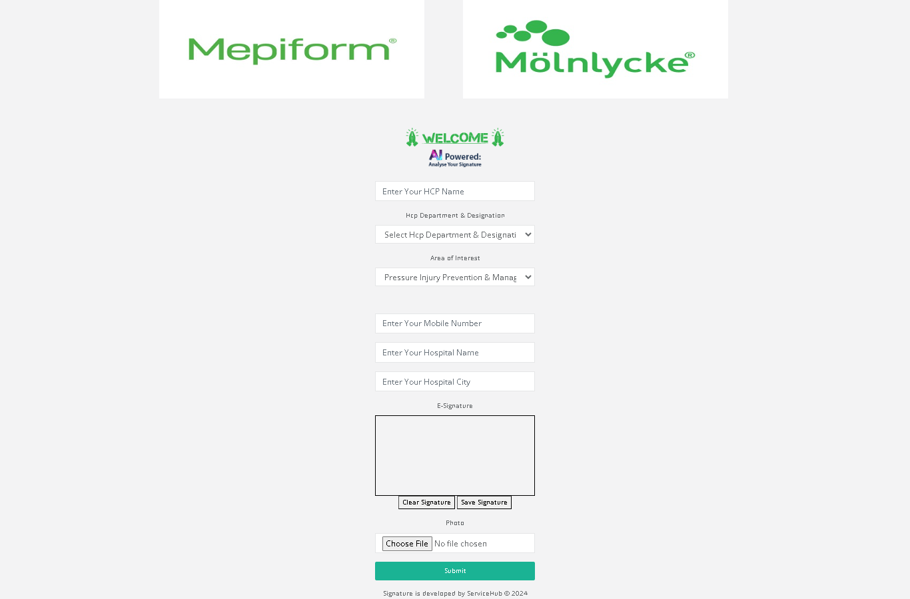
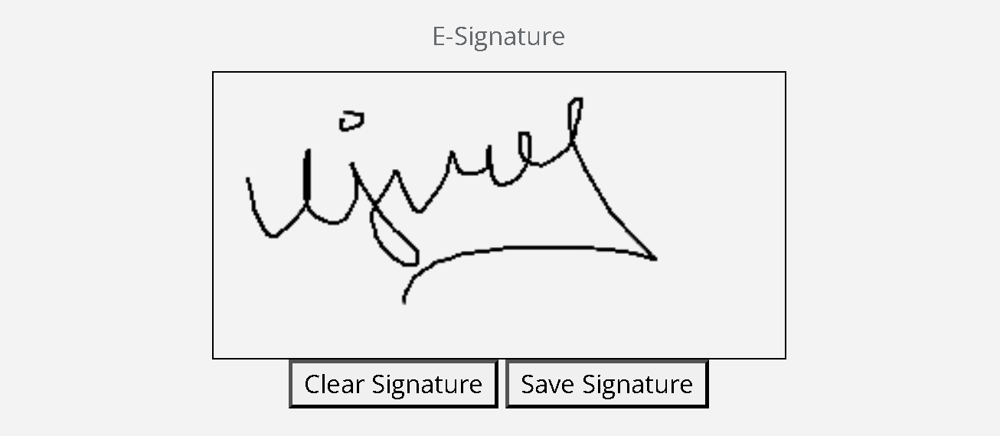
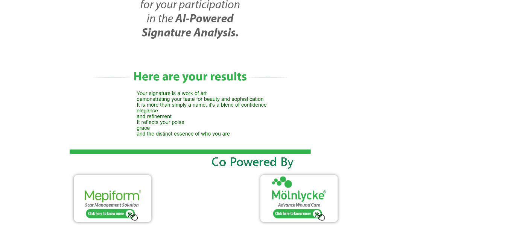

# Signature: AI-based Signature Analysis

Signature is a web application where users can get AI-based insights about their signatures. The application uses Java Tesseract, an open-source optical character recognition (OCR) platform, to extract text from images of signatures and provide detailed analysis.





## About the Project

- **Purpose**: To provide AI-based insights and analysis of user signatures.
- **Technology Stack**: Laravel for backend, Java Tesseract for OCR.
- **Users**: Currently used by over 50,000 doctors.
- **Features**:
  - Upload signature images for analysis.
  - Extract text and details from the signature using OCR.
  - Provide detailed insights based on the extracted text.

## Features

- **Signature Upload**: Users can upload images of their signatures.
- **Optical Character Recognition (OCR)**: Extracts text and details from signature images using Java Tesseract.
- **AI-based Analysis**: Provides detailed insights and analysis based on the extracted text.
- **User Dashboard**: Personalized dashboard for users to view their analysis history and reports.
- **Admin Panel**: Manage users, view analytics, and configure settings.

## Technologies Used

- **Backend**: Laravel
- **OCR**: Java Tesseract
- **Database**: MySQL
- **Frontend**: HTML, CSS, JavaScript, Bootstrap
- **Other Libraries**: Axios for HTTP requests, Font Awesome for icons

## Project Structure

- **app/**: Contains the core application files.
- **public/**: Publicly accessible files, such as images, JavaScript, and CSS.
- **resources/**: Views and frontend assets.
- **routes/**: Application routes.
- **storage/**: Log files and other storage.
- **tests/**: Automated tests.

## Installation

1. **Clone the Repository**

   ```bash
   git clone https://github.com/ujwaldangij/Signature.git
